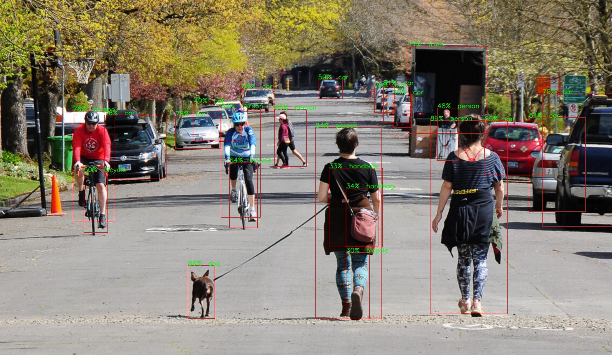
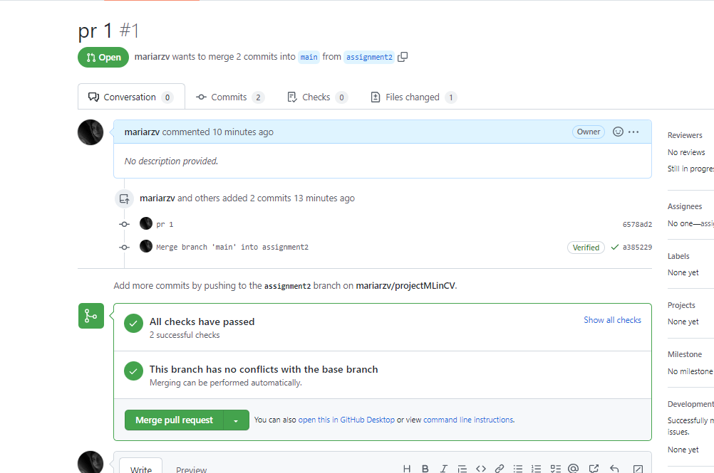
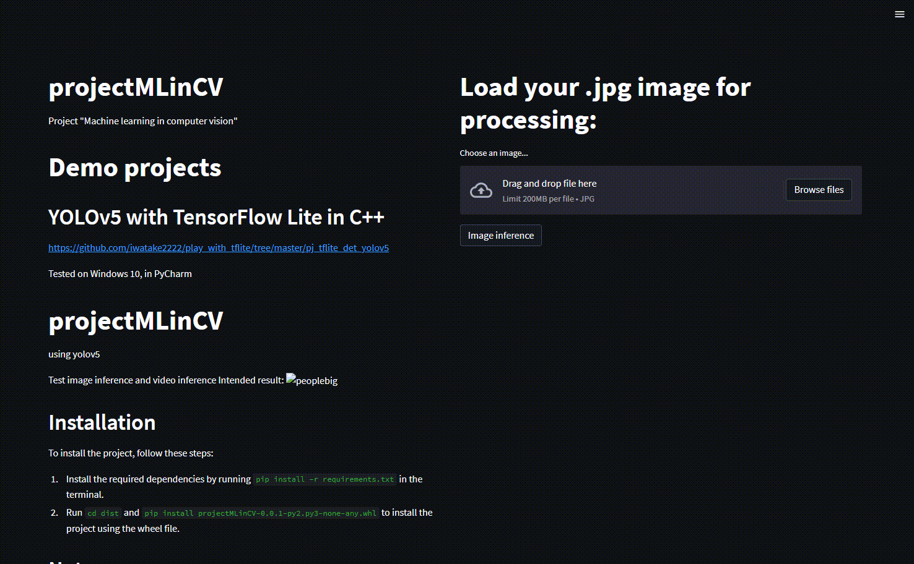

# projectMLinCV
Project "Machine learning in computer vision"

# Demo projects

## YOLOv5 with TensorFlow Lite in C++
https://github.com/iwatake2222/play_with_tflite/tree/master/pj_tflite_det_yolov5


Tested on Windows 10, in PyCharm

# projectMLinCV
using yolov5

Test image inference and video inference
Intended result:



## Installation

To install the project, follow these steps:

1. Install the required dependencies by running `pip install -r requirements.txt` in the terminal.
2. Run `cd dist` and `pip install projectMLinCV-0.0.1-py2.py3-none-any.whl` to install the project using the wheel file.

## Notes

Project is configured in PyCharm  2022.3.2 (Community Edition)
Project follows PEP8 style.

### Additionally about linters and style tools:

Style tools - autopep8 (run directly or use PyCharm Tools > style > autopep8)

Linters - flake8 (run directly or use PyCharm Tools > lint > flake8)
autopep8 and flake8 configs are in setup.cfg 
(autopep8 config is called pycodestyle, flake8 config is called flake8)
Tests - pytest

All of these tools are added to requirements.txt >> will install in your venv with everything else.
The tools are configured in PyCharm as external tools. 

#### flake8 issues fix log:
utils.py:
	No issues found.
yolov5_tflite_folder_of_images_inference.py:
	Issues fixed.
yolov5_tflite_image_inference.py:
	F401 'PIL.ImageOps' imported but unused
	(not an issue)
	Other issues fixed.
yolov5_tflite_inference.py:
	Issues fixed.
yolov5_tflite_video_inference.py:
	Issues fixed.
yolov5_tflite_webcam_inference.py:	
	F841 local variable 'no_of_frames' is assigned to but never used
	(not an issue)
	Other issues fixed.

#### pytest
pytest set as default test runner in PyCharm.

### CI 
PR/MR check implemented:


### Docker 

Get Docker image from Docker hub:
```bash
docker pull mariarazv/mlincv
```
(Or download from [rmv_yolov5](https://hub.docker.com/r/mariarazv/mlincv) )
Docker image is created to run streamlit app automatically when container is run.
It is set to expose port 8501 for access to streamlit app.
Use this command to run the image "rmv_yolov5":
```bash
docker run -p 8501:8501 rmv_yolov5
```
Then access streamlit app on localhost port 8501.


